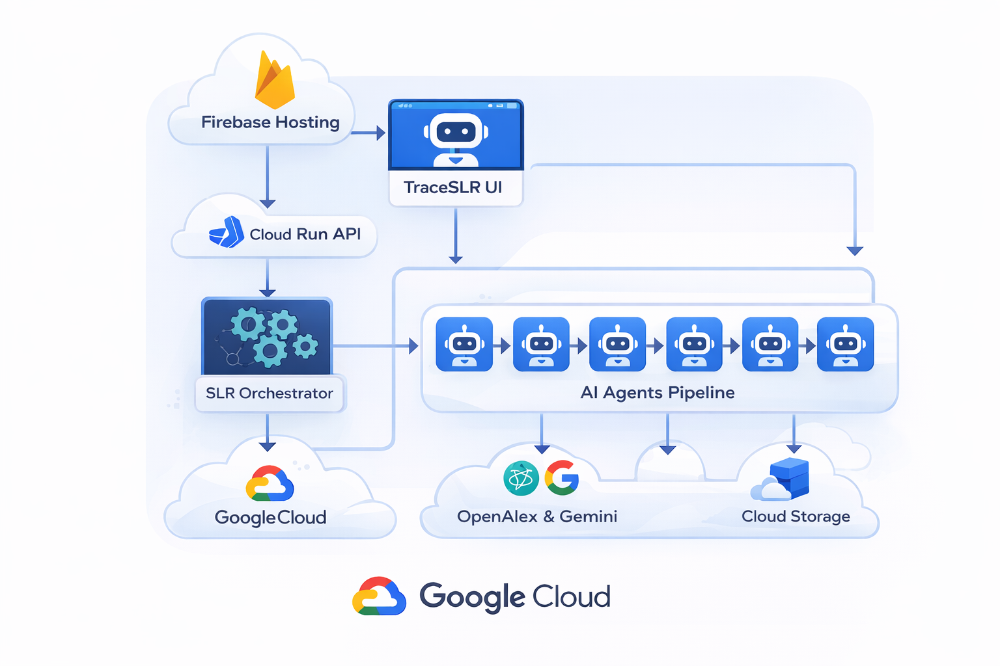
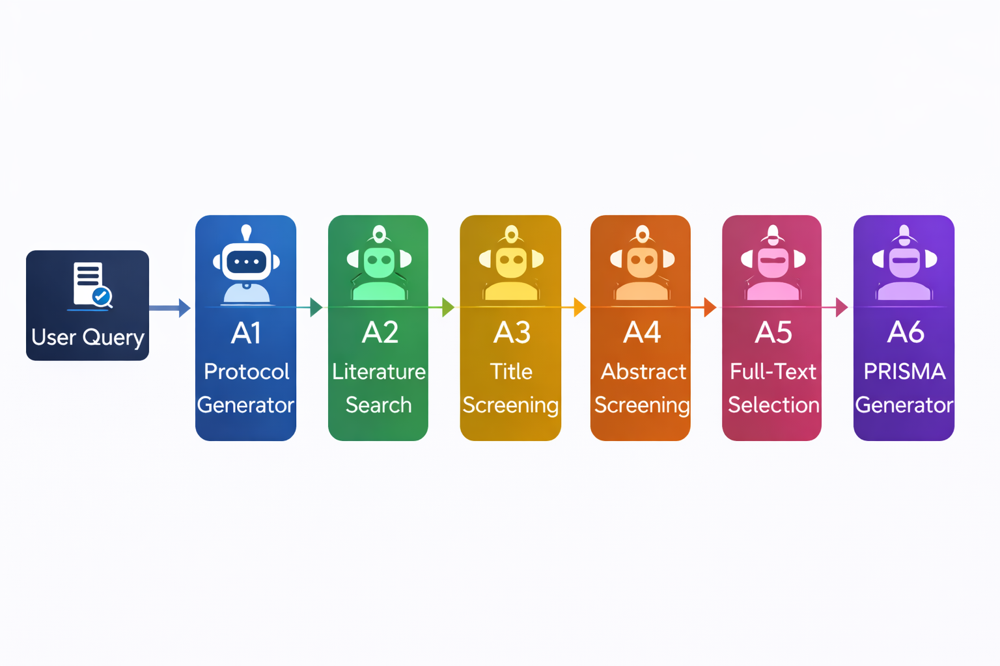
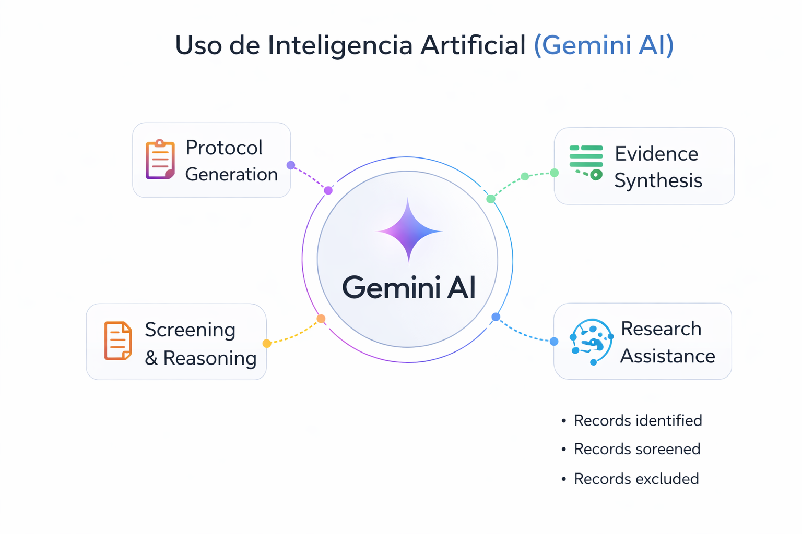
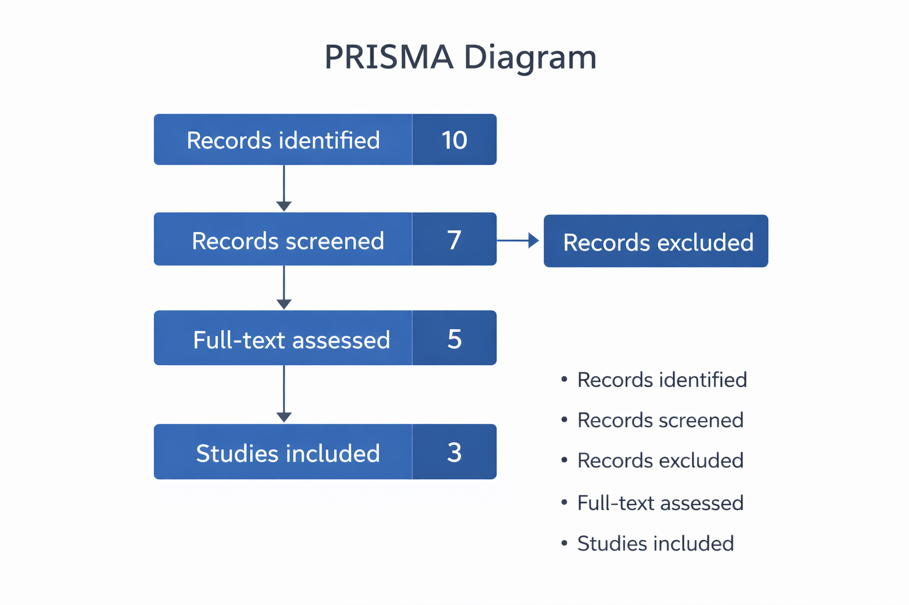
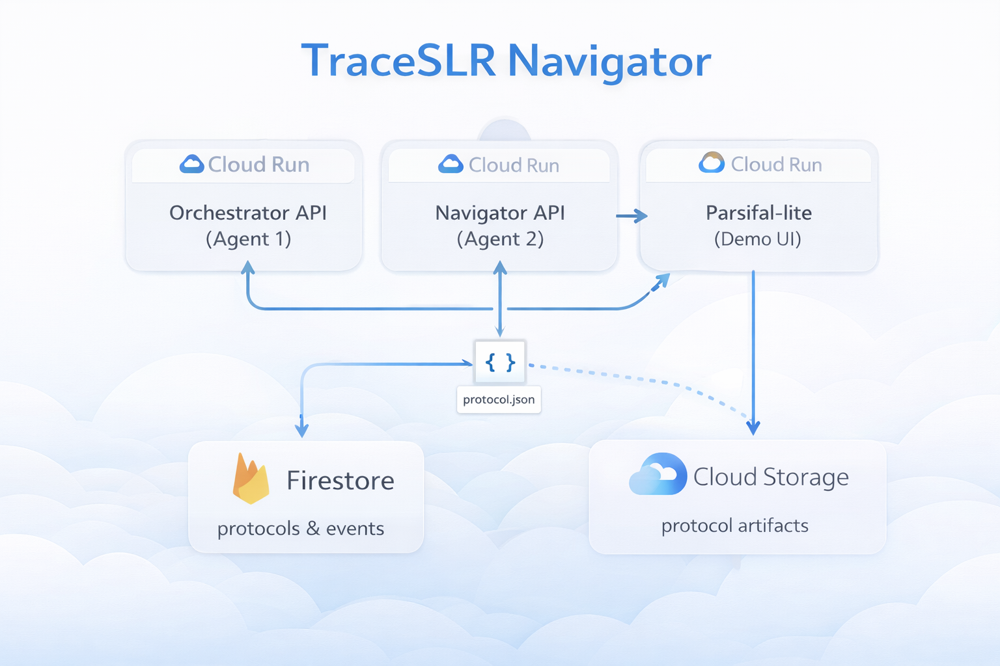
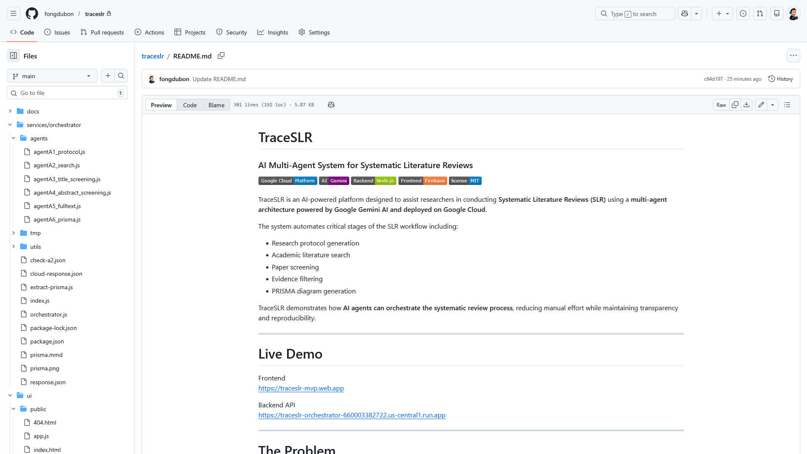

# TraceSLR
### AI Multi-Agent System for Systematic Literature Reviews

TraceSLR is an AI-powered platform designed to assist researchers in conducting **Systematic Literature Reviews (SLR)** using a **multi-agent architecture powered by Google Gemini AI and deployed on Google Cloud**.

The system automates critical stages of the SLR workflow including:

- Research protocol generation
- Academic literature search
- Paper screening
- Evidence filtering
- PRISMA diagram generation

TraceSLR demonstrates how **AI agents can orchestrate the systematic review process**, reducing manual effort while maintaining transparency and reproducibility.

---

# Live Demo

Frontend  
https://traceslr-mvp.web.app  

Backend API  
https://traceslr-orchestrator-660003382722.us-central1.run.app  

---

# The Problem

Systematic Literature Reviews are fundamental for scientific research but require **significant manual effort**.

Researchers must typically:

1. Define research protocols  
2. Build search queries  
3. Search academic databases  
4. Screen titles and abstracts  
5. Evaluate full-text articles  
6. Produce PRISMA diagrams for reporting  

This process can take **weeks or even months**.

---

# Our Solution

TraceSLR introduces a **multi-agent AI system** that automates the systematic review workflow.

Instead of manually executing each step, a pipeline of specialized AI agents performs the process automatically.

The system orchestrates:

- protocol generation
- literature search
- screening
- selection
- PRISMA reporting

---

# System Architecture

TraceSLR consists of three main layers:

1. Web Interface  
2. Cloud Orchestrator API  
3. Multi-Agent AI Pipeline  

Architecture components:

Frontend  
- Firebase Hosting  
- Web UI (HTML / JavaScript)

Backend  
- Node.js API  
- Express server  
- Multi-agent orchestrator

Infrastructure  
- Google Cloud Run  
- Firestore database  
- Cloud Storage artifacts

External services  
- OpenAlex academic database  
- Google Gemini AI

---

# Multi-Agent Pipeline

TraceSLR uses a pipeline of **specialized AI agents**, each responsible for a stage of the SLR workflow.

| Agent | Function |
|------|------|
| A1 | Research protocol generation |
| A2 | Literature search |
| A3 | Title screening |
| A4 | Abstract screening |
| A5 | Full-text selection |
| A6 | PRISMA diagram generation |

The orchestrator coordinates the agents sequentially to complete the systematic review process.

---

# AI Integration (Gemini)

TraceSLR leverages **Google Gemini AI** to assist several reasoning-intensive stages of the workflow.

AI capabilities include:

- research protocol generation  
- academic paper screening  
- relevance reasoning  
- evidence synthesis support  

This allows the system to simulate the reasoning process typically performed by researchers.

---

# PRISMA Workflow

TraceSLR automatically generates a **PRISMA diagram**, the standard reporting structure used in systematic reviews.

The PRISMA diagram summarizes:

- records identified
- records screened
- records excluded
- full-text assessed
- studies included

---

# Example Workflow

1. User enters a research question.

Example:
How can business intelligence support decision making in university internships?

2. The orchestrator launches the AI agent pipeline.

3. Academic papers are retrieved automatically from OpenAlex.

4. Screening agents evaluate relevance.

5. The PRISMA diagram is generated automatically.

---

# MVP Design Decision: Limited Paper Retrieval

The current prototype retrieves **10 academic papers per query**.

This design decision was made intentionally for the MVP to:

- control AI inference cost
- reduce system latency
- enable real-time demonstrations during the hackathon

Processing hundreds of papers would require multiple AI screening calls, significantly increasing runtime and cost.

Future versions will support configurable search depth (e.g., 50–500 papers).

---

# Example PRISMA Output

Typical pipeline results:
records_identified: 10
records_screened: 7
records_excluded: 3
full_text_assessed: 5
studies_included: 3

These values are dynamically generated by the screening agents.

---

# Cloud Architecture

TraceSLR runs entirely on **Google Cloud infrastructure**.

Components include:

Frontend  
Firebase Hosting

Backend  
Cloud Run API

Data Storage  
Firestore  
Cloud Storage

AI Services  
Gemini AI

Academic Sources  
OpenAlex API

---

# Project Structure

---

# Running the Project Locally

Install dependencies
npm install

Start backend
node index.js

Open frontend
ui/public/index.html

---

# Future Work

Future improvements include:

- Integration with additional academic databases
- Advanced paper ranking
- Citation network analysis
- Automated literature synthesis
- Knowledge graph generation
- Full Parsifal-style SLR management platform
- Collaborative screening dashboards
- Large-scale literature processing (100+ papers)

The next stage of TraceSLR will integrate **Parsifal-style SLR management features**, transforming the system into a complete AI-powered systematic review platform.

---

# Tech Stack

Frontend  
HTML  
CSS  
JavaScript  
Firebase Hosting  

Backend  
Node.js  
Express  

AI  
Google Gemini  

Cloud Infrastructure  
Google Cloud Run  
Firestore  
Cloud Storage  

External Data  
OpenAlex Academic API

---

# Authors

Eduardo Fong Dubon

---

# License

MIT License

---

# Acknowledgments

Google Cloud  
Google Gemini AI  
OpenAlex Academic API

